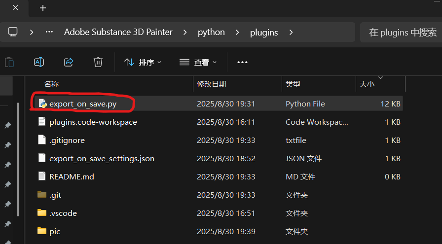

# Substance painter python plugin: ExportActiveTextureSetOnSave

This is a substance painter python plugin for automatically exporting active texture when .spp file is saved.

Built for Substance Painter v11.0.1. The plugin has not been tested for other version yet.

# Installation

1. In substance painter application, find menu `Python` and select `Plugins Folder`:

2. Open the subfolder `plugins`:

3. Download the file `export_on_save.py` in this repository into the folder `plugins`:

4. In substance painter application, click `Python - Reload Plugins Folder`

5. There should be `export_on_save` in the `Python` menu. Check it, and there should be a new menu `Export on Save`:

6. Installation completed.

# Usage

The plugin will use current export settings during exporting.

So, at first:
1. Open `Export textures` dialog under `File` menu: 
2. Fill the `Global settings`: 
3. Click `Save Settings` at the bottom of the `Export textures` dialog

Then just check `Enable Auto Export on Save` under the menu `Export on Save`:

The plugin will export the active texture set when the project is saved, using the glboal export settings filled in `Export textures` dialog.

# If something goes wrong

Check the log by `Window - Views - log`:

# Developer Note

* Project is locked during the `PostSaved` event
	* Substance painter hide a python api `_substance_painter.project.do_action(_substance_painter.project.Action.Unlock)` for project locking/unlocking
* Python API cannot access current export options
	* Javascript API can
	* Check the document by `Help - Scripting Documentation - Javascript API` in substance painter application
* Javascript API `alg.settings` is undefined
	* So `export_on_save_settings.json` stored in the same directory with the plugin python file is used instead
* There is always a warning about deprecated method `_utility.make_callable`
	* It is called by `TextureSet.name()` which is a sustance painter python API internal method
	* As a walkaround, just use the hidden python API `_substance_painter.textureset.material_name`
* So many hidden API, substance painter's plugin api seems to be a shit
	* YES, F**K AD@BE